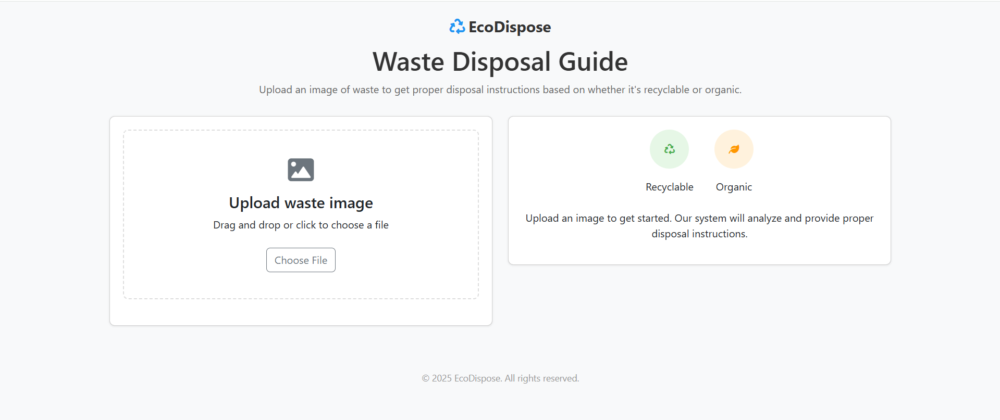
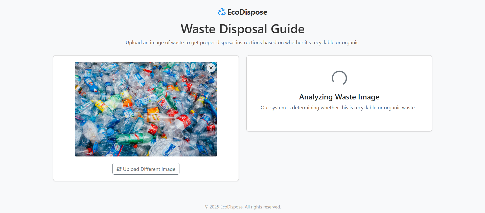
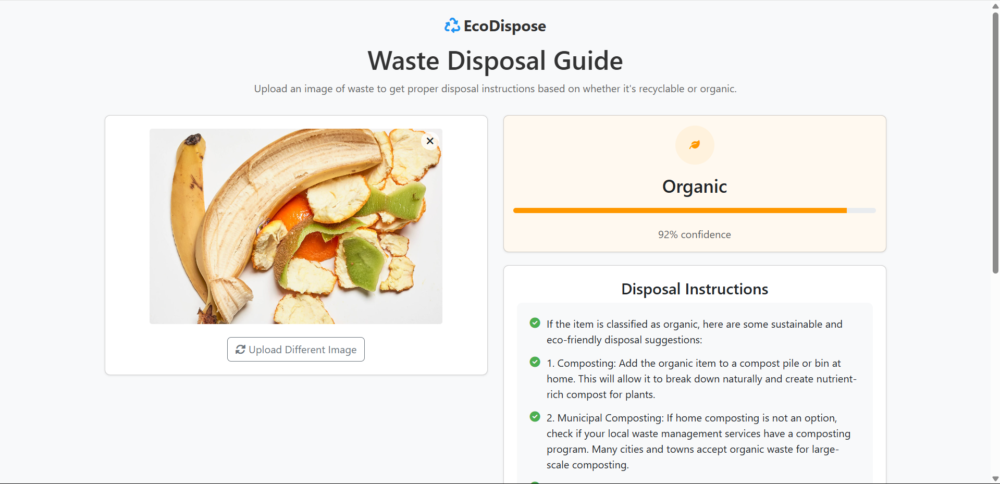
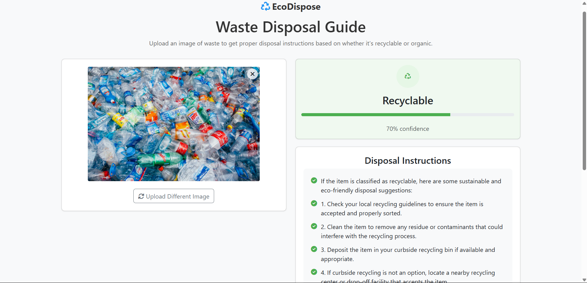

# EcoDispose: AI-Powered Waste Management Platform

EcoDispose is an AI-powered waste classification platform built with Flask and HTML-CSS-Javascript. It uses a CNN model to classify waste and rewards users for making eco-friendly decisions.

---

## Features
- AI-powered waste classification using a TensorFlow `.h5` model with convolutional neural networks.
- Integrated with OpenAI's **ChatGPT 4o** to provide users with sustainable and eco-friendly disposal methods.
- No user authentication required to classify waste, ensuring a hassle-free user experience.

---

## Tech Stack
### Frontend:
- HTML
- CSS
- JavaScript

### Backend:
- Flask (Python)

### AI/ML:
- TensorFlow (Python) for waste classification.
- Flask API to load and predict using `waste_classification_model.h5`.
- OpenAI API (ChatGPT 4o) for suggesting eco-friendly disposal methods.

---

## Demonstration

### Home

### Analysis

### Organic Result

### Recyclable Result

---
## Video Demonstration
Video Link: [Link](https://drive.google.com/drive/folders/1bbUHPbiW1UwBAwh5GQoPMdJhewJHjsdM)

---
## How to get started
1. Clone the repository using `git clone https://github.com/Dhruv10-8/EcoDispose.git`
2. Install the required packages using `pip install -r requirements.txt`
3. Run the Flask application using `python app.py`
4. Open your web browser for `index.html`
5. Start classifying waste and get eco-friendly suggestions from ChatGPT 4o!
